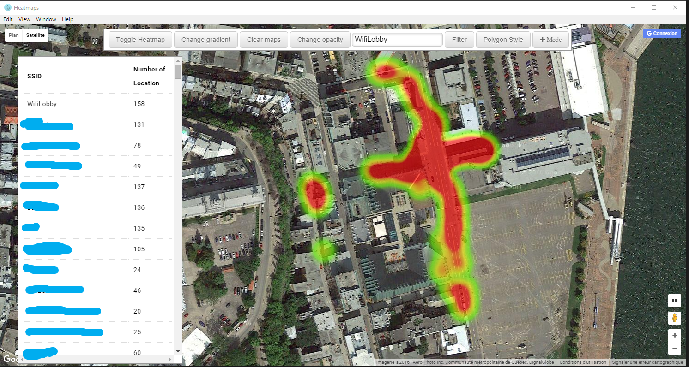

# WifiHarvester-DesktopApp
The visualization tool to use after you have collected the data with the android app.

## How to use it
When you launch the app, you will be prompt to choose the file with the data from th android's application.
Once you choose it, you will see a heat of the place you walk. Each heat points represent Wi-Fi data.

Feature

- You can filter by SSID
- You can add heat points by click to the location to add points (to fill space between two points)
- You can delete heat points, by switching the mode (in top right corner)

## TODO

- Add false data for test
- Add some test
- Add UI element : SSID List, Number of AP
- Detect position to center the map
- Correct bug with the polygons display
- Add method to filter wrong data (like an average of data to ensure the quality)

## Development
###DEBUG
To use the debug option on Windows: set DEBUG=*,-not_this